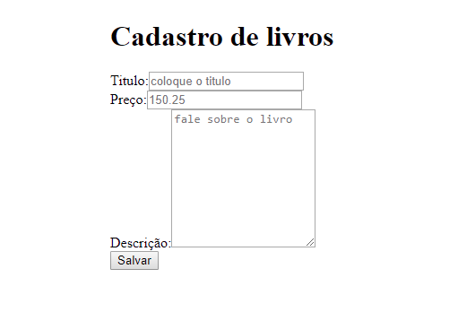
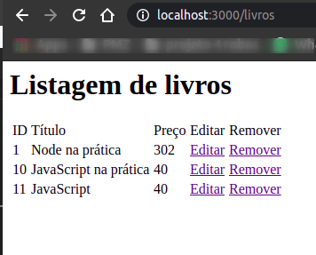

# Node.js: Desenvolvendo com JavaScript no backend 
A aplicação que construiremos durante esse curso será baseada na já conhecida Casa do Código, e consistirá em uma lista de livros na qual o usuário poderá adicionar, remover, editar, entre outras funcionalidades.
<h1 align="center"></img></h1>
<h1 align="center"></img></h1>

# ✋🏻 Pré-requisitos
- [Node.js](https://nodejs.org/en/)
- [Npm](https://docs.npmjs.com/cli/v7/commands/npm-start)

## :computer: Ferramentas Utilizadas

## Features
Para o desenvolvimento do projeto foi utilizada uma stack com as seguintes tecnologias:

- 💹 **Node Js** — Web framework que permite utilizar javascript tanto no frontend quanto no backend;

## 🚀  Tecnologias
Backend:
-   [Node.js](https://nodejs.org/en/)
-   [Express](https://expressjs.com/pt-br/)
-   [Sqlite](https://www.sqlite.org/docs.html)
-   [node-sqlite3](https://github.com/mapbox/node-sqlite3/wiki/API#database)
-   [Nodemon](https://www.npmjs.com/package/nodemon)
-   [HTMLElement.dataset](https://developer.mozilla.org/pt-BR/docs/Web/API/HTMLOrForeignElement/dataset)
-   [Utilizando data attributes](https://developer.mozilla.org/pt-BR/docs/Learn/HTML/Howto/Use_data_attributes)
-   [Express + Marko](https://markojs.com/docs/express/)
-   [Express Middlewares](http://expressjs.com/pt-br/guide/using-middleware.html)
-   [Method-override](https://github.com/expressjs/method-override)

## 🔥 Instalação e execução

1. Faça um clone desse repositório;
2. Entre na pasta `cd casadocodigo`;
3. Rode `npm install` dentro da pasta `casadocodigo`;
4. Na pasta `casadocodigo` execute `npm start` pra iniciar o servidor de desenvolvimento;

### Postman 
Para testar a API do Be The Hero, baixe e instale o [Postman](https://www.postman.com). 

----------
Feito com ♥ by Tayna Rodrigues - Manaus-AM  👋 